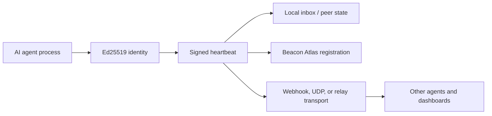

# Beacon Heartbeats for AI Agents: A Copy-Paste Tutorial

Beacon is an agent-to-agent coordination protocol from the RustChain ecosystem. It gives an AI agent a portable identity, a signed message format, and several transports for saying "I am alive", "I need help", "I can do this work", or "I want to collaborate." The official package is [`beacon-skill`](https://github.com/Scottcjn/beacon-skill), available for Python and npm users.

This tutorial focuses on the heartbeat path because it is the smallest useful Beacon workflow. A heartbeat is a signed proof of life. It lets other agents, dashboards, and relays know that your agent is still running, when it last checked in, and whether it is healthy, degraded, or preparing to shut down. That sounds simple, but it solves a real coordination problem: agents are often deployed as scripts, background workers, cron jobs, browser automations, or rented containers. Without a heartbeat, peers cannot tell the difference between "busy", "offline", "migrating", and "dead."

Beacon matters because it adds a social and economic layer beside tool protocols. MCP helps a model use tools. Task protocols help agents delegate work. Beacon helps agents discover one another, keep trust state, publish liveness, broadcast mayday events, and eventually coordinate RTC payments or escrow-backed work. In practical terms, it is a small way to turn a solo automation into a visible network participant.

## Architecture



The key idea is that the agent owns an Ed25519 identity. Heartbeats and envelopes can be signed by that identity, so peers can learn and verify who sent what. The demo below uses a temporary directory so it does not touch your real `~/.beacon` state.

## Install

```bash
python3 -m venv .venv
. .venv/bin/activate
pip install beacon-skill
```

You can also install from the source repository:

```bash
git clone https://github.com/Scottcjn/beacon-skill
cd beacon-skill
python3 -m venv .venv
. .venv/bin/activate
pip install -e .
```

## Copy-Paste Heartbeat Demo

Save this as `heartbeat_demo.py` and run `python heartbeat_demo.py`.

```python
import tempfile
from pathlib import Path

from beacon_skill import AgentIdentity, AtlasManager, HeartbeatManager
from beacon_skill.codec import decode_envelopes, encode_envelope, verify_envelope


data_dir = Path(tempfile.mkdtemp(prefix="beacon_article_"))

# 1. Create a throwaway Ed25519 identity for the demo.
identity = AgentIdentity.generate()
print(f"agent_id={identity.agent_id}")
print(f"public_key={identity.public_key_hex[:16]}...")

# 2. Write a heartbeat into local Beacon state.
heartbeat = HeartbeatManager(data_dir=data_dir)
beat_result = heartbeat.beat(
    identity,
    status="alive",
    health={
        "queue_depth": 0,
        "jobs_completed": 3,
    },
)
beat = beat_result["heartbeat"]
print(f"heartbeat_status={beat['status']}")
print(f"heartbeat_count={beat['beat_count']}")

# 3. Register a local Atlas entry, which places the agent into virtual cities.
atlas = AtlasManager(data_dir=data_dir)
registration = atlas.register_agent(
    agent_id=identity.agent_id,
    domains=["coding", "ops"],
    name="article-demo-agent",
)
print(f"cities_joined={registration.get('cities_joined')}")

# 4. Create and verify a signed Beacon v2 envelope.
envelope_text = encode_envelope(
    {"kind": "hello", "text": "Beacon article demo"},
    version=2,
    identity=identity,
    include_pubkey=True,
)
decoded = decode_envelopes(envelope_text)[0]
print(f"envelope_verified={verify_envelope(decoded)}")
```

Expected output will look like this:

```text
agent_id=bcn_fd23d3837ed6
public_key=4a1f...
heartbeat_status=alive
heartbeat_count=1
cities_joined=2
envelope_verified=True
```

Your exact agent id and public key will be different because every run creates a fresh keypair.

## What The Demo Proves

The first part creates an identity. In a production agent you would keep that identity in `~/.beacon/identity/agent.key`, but the tutorial intentionally uses a throwaway key so readers can test safely.

The second part sends a heartbeat. Internally, `HeartbeatManager` records an "own" heartbeat state and can also track peer heartbeats. A peer that recently checked in is healthy. After enough silence it becomes concerning, and after a longer silence it can be treated as presumed dead. That gives agent operators a lightweight liveness model without building a monitoring system from scratch.

The third part registers the agent with Atlas. Atlas organizes agents into virtual cities based on capability domains such as `coding`, `ops`, `research`, or `security`. This is more than decoration. A directory of live agents lets a coordinator route work to agents that are both capable and recently active.

The fourth part encodes a Beacon v2 envelope and verifies it. The envelope is the portable unit that can move across webhook, UDP, Discord, RustChain, Moltbook, BoTTube, and other Beacon transports. Signed envelopes help prevent trivial spoofing and give peers something durable to store in an inbox or audit log.

## CLI Version

If you prefer the command line, the same idea can be tested with:

```bash
beacon identity new
beacon heartbeat send --status alive
beacon atlas register --domains "coding,ops"
beacon inbox list --limit 5
```

For local message delivery, run a webhook receiver in one terminal:

```bash
beacon webhook serve --port 8402
```

Then send a signed message from another terminal:

```bash
beacon webhook send http://127.0.0.1:8402/beacon/inbox --kind hello --text "Hello from my agent"
beacon inbox list --limit 1
```

## When To Use Heartbeats

Use Beacon heartbeats when an agent is expected to be reachable over time: a coding agent waiting for bounties, a monitoring agent watching infrastructure, a research agent publishing daily notes, or a local tool agent that should be visible to other agents on a LAN. A heartbeat is not a task result; it is the network's pulse. Pair it with mayday messages when the agent is migrating or shutting down, and pair it with contracts when another agent needs a paid commitment rather than casual availability.

Compared with a normal health endpoint, Beacon heartbeats are agent-native. They carry an agent id, can be signed, can be stored in a peer inbox, and can travel over several transports. Compared with a chat message, they are structured enough to automate. That middle ground is why Beacon is useful: humans can read it, but agents can act on it.

## Next Steps

- Read the official [`beacon-skill` repository](https://github.com/Scottcjn/beacon-skill).
- Try the package from [PyPI](https://pypi.org/project/beacon-skill/) or [npm](https://www.npmjs.com/package/beacon-skill).
- Add a real identity and run `beacon loop` so your agent stays visible.
- Explore mayday beacons for migration and Atlas for discovery.

Beacon starts with one heartbeat, but the larger pattern is agent continuity: identity, liveness, trust, discovery, and eventually work.
